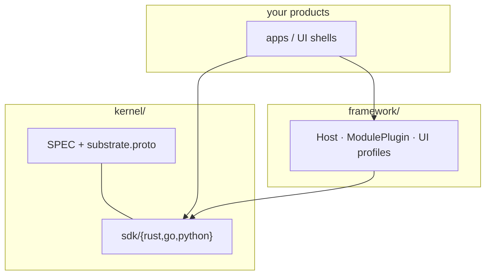

# srcport-substrate

**Monorepo: kernel + optional framework.**

Two top-level products with a hard dependency boundary — the framework may
depend on the kernel; the kernel never depends on the framework.

| Product | Path | Role |
|---------|------|------|
| **Kernel** | [`kernel/`](kernel/) | Domain-neutral microkernel: contract, SDKs, conformance |
| **Framework** | [`framework/`](framework/) | Opinionated host, module plugins, UI profiles; SDKs in `framework/sdk/{rust,go,python}` |

```text
srcport-substrate/
├─ kernel/          ← substrate SPEC · proto · SDKs
├─ framework/       ← host · plugins · UI profiles · sdk/{rust,go,python}
├─ docs/            ← short concept guides
├─ README.md        ← you are here
└─ LICENSE*
```



## Start here

| Goal | Go to |
|------|--------|
| Read the substrate contract | [`kernel/SPEC.md`](kernel/SPEC.md) |
| Kernel overview & diagrams | [`kernel/README.md`](kernel/README.md) |
| Wire format | [`kernel/contracts/proto/.../substrate.proto`](kernel/contracts/proto/srcport/substrate/v1/substrate.proto) |
| Framework charter | [`framework/SPEC.md`](framework/SPEC.md) |
| Framework usage | [`framework/README.md`](framework/README.md) |
| Agent / contributor guide | [`AGENTS.md`](AGENTS.md) |
| Test the framework | `cargo test --manifest-path framework/sdk/rust/Cargo.toml` |

## Kernel (summary)

Seven primitives (Module · Artifact · Contract · Event · Ledger · Registry ·
Run) plus one `KernelApi`. Domain-neutral. Immutable artifacts are the data
plane; assemblies are human-owned; the ledger is tamper-evident.

```bash
# regenerate Go/Python types from the proto (from monorepo root)
bash kernel/scripts/gen.sh

cargo test --manifest-path kernel/sdk/rust/Cargo.toml
cd kernel/sdk/go && go test ./...
pip install ./kernel/sdk/python && python -m unittest discover -s kernel/sdk/python/tests -v
```

## Framework (summary)

Optional application layer: `Host` drives claim → optional UI hooks → execute →
commit. Plugins implement domain work; UI is opt-in via `srcport.ui.v1` JSON
artifacts. Does **not** change `substrate.proto`.

```bash
cargo test --manifest-path framework/sdk/rust/Cargo.toml
cd framework/sdk/go && go test ./...
pip install ./kernel/sdk/python ./framework/sdk/python
python -m unittest discover -s framework/sdk/python/tests -v
```

## Rule

> **One canonical kernel contract, many conforming implementations.**  
> Widen the kernel by *adding* to the contract. Put product opinions in
> `framework/`, never reverse-depend into `kernel/`.

## License

Dual-licensed under MIT OR Apache-2.0. See [`LICENSE`](LICENSE),
[`LICENSE-MIT`](LICENSE-MIT), and [`LICENSE-APACHE`](LICENSE-APACHE).
