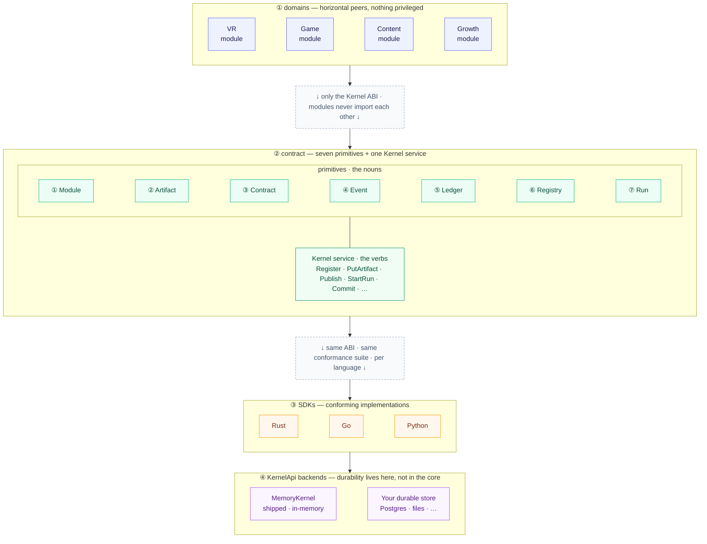
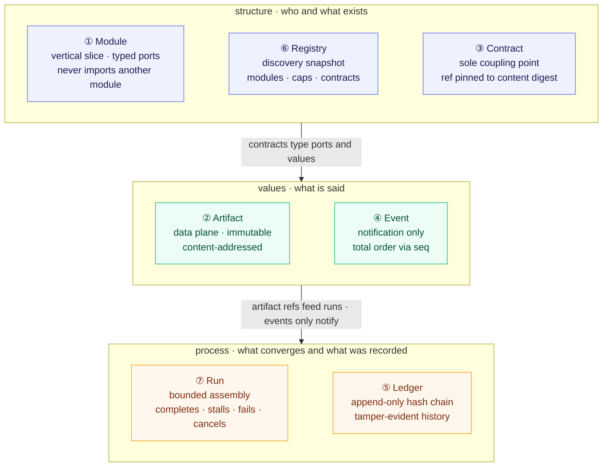
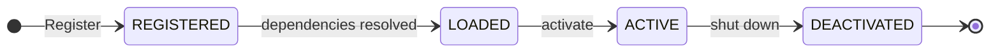
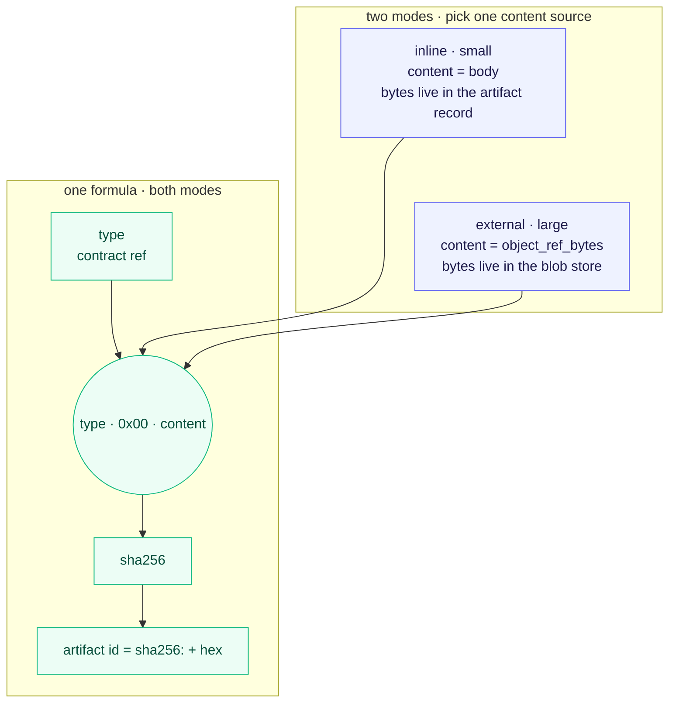
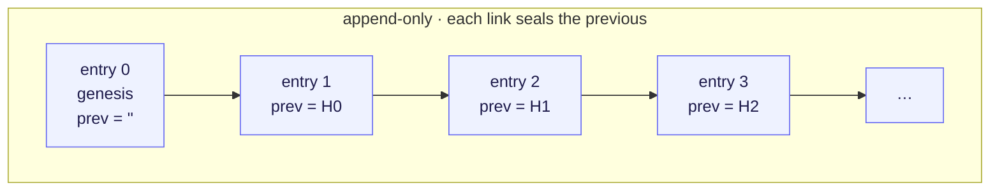
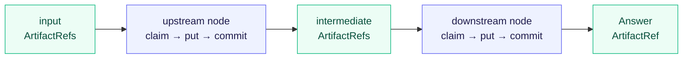
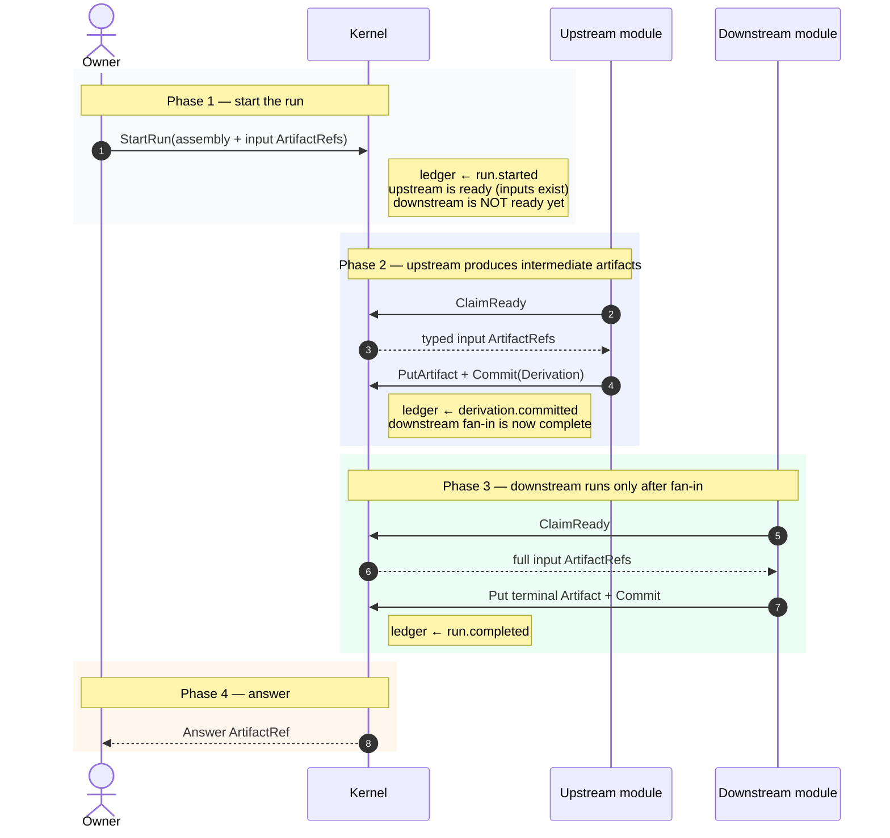
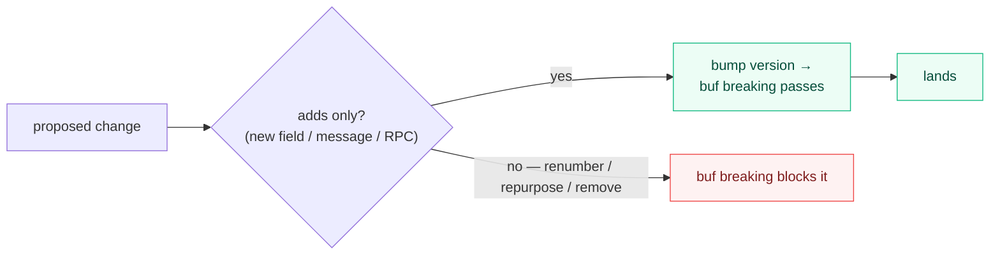

# srcport-substrate

**One canonical contract, many conforming implementations.**

This repo is a **specification, not a framework**. It defines a small,
domain-neutral microkernel as a language-neutral contract; SDKs in each language
you need (Rust first) conform to it. Production consumers may run their own
durable backends — what must not be re-derived is the contract and its
invariants, not necessarily the storage implementation.

**Durability lives in Modules, not the core.** Each SDK ships an in-memory
`MemoryKernel` that implements the portable `KernelApi` so the contract is
executable and conformance-testable. That type is *one* backend, not the
authority — persistence belongs in Modules or in another `KernelApi`
implementation over durable storage.

- **[`SPEC.md`](SPEC.md)** — the two-page human-owned specification. Read this.
- **[`substrate.proto`](contracts/proto/srcport/substrate/v1/substrate.proto)** — the canonical contract (protobuf-first).
- **[`buf.yaml`](buf.yaml)** — lint + breaking-change enforcement.

---

## The big picture

Every project — VR, games, content, growth — is just a set of **Modules**
sitting on top of one shared, versioned contract. Modules never see each other;
they see only the kernel. Read the stack top-down: domains rest on the contract;
SDKs and backends sit *under* the contract and implement it.



Nothing in the kernel knows about any domain. That shared, versioned contract is
the thing that finally becomes boring, trusted, and legible.

---

## See it run

[`example/`](example/) builds a tiny three-module domain on the Rust SDK, drives
a **real** convergent Run, then reconstructs the whole dataflow **solely by
decoding the append-only ledger** — proving, not merely illustrating, that
artifact refs are the data plane and the chain records exactly what happened.

```
cd example && cargo run
```

It prints a live trace and writes a self-contained `flow.html` — every box and
arrow rebuilt from the tamper-evident chain, never from live kernel state.

---

## The seven primitives

Seven primitives (the nouns) plus one `Kernel` ABI — the verb set (`Register`,
`PutArtifact`, `Publish`, …) that operates on them. Small enough to hold in your
head. There is no kernel-level authorisation: systems built on this core are trusted.
In-process, the ABI is the `KernelApi` surface; `MemoryKernel` is the default
in-memory implementation.

They form three horizontal bands — structure, values, process — peer groups at
the same level of concern. Contracts type the structure and value bands; artifact
refs (not events) feed runs; every action lands on the ledger.



| # | Primitive | Guarantees |
|---|-----------|------------|
| ① | **Module** | A vertical slice with typed capability ports; never imports another module. |
| ② | **Artifact** | Typed, content-addressed, **immutable**. Small values inline; large values hold a verified external blob ref. Same typed value ⇒ same id. |
| ③ | **Contract** | The declarative schema — the **sole** coupling point. Immutable identity: `ref` pinned to a content `digest`. |
| ④ | **Event** | Publish/subscribe topics with a kernel-assigned **total order** (`seq`). |
| ⑤ | **Ledger** | Append-only, **hash-chained**, tamper-evident record of every action. |
| ⑥ | **Registry** | Discovery — "what modules, capabilities, and contracts exist right now?" |
| ⑦ | **Run** | Applies an immutable input set to a finite typed assembly; must close as completed, stalled, failed, or cancelled. |

---

## Module lifecycle

A module moves through exactly four states — no back-doors, no skipping.
States are a strict forward chain (horizontal), not a free graph:



---

## Content addressing

Typed **value** identity is sha256 over `type · 0x00 · content`, where `content`
is either the small inline `body` or the address-bytes of a verified `ObjectRef`
(digest · byte_count · namespace). Flipping a single byte yields a brand-new id.
**Blob** identity is separate: `digest = sha256(raw bytes)` only.

Two horizontal modes share one id formula; only the content source differs:



| Mode | Content hashed into artifact id | Bytes live in |
|------|----------------------------------|---------------|
| **Inline** (small) | `body` | the artifact record |
| **External** (large) | `object_ref_bytes(ObjectRef)` | blob store (`PutBlob` / `GetBlob`) |

Modules place large evidence (PCAP, APK, bundles) by putting the blob once and
committing an artifact that holds only the verified ref — no copy into the
typed value store.

---

## The ledger is a hash chain

Every meaningful kernel action appends one entry, and each entry commits to the
previous entry's hash. Tamper with any entry and every later hash stops
verifying — the whole history is agent-observable and tamper-evident.



Each `hash = sha256(seq, kind, subject, detail, prev_hash)`.

---

## How the primitives converge (the bounded, feed-forward run)

A **Run** freezes a finite acyclic assembly plus immutable input **Artifact**
refs. Modules never call each other: each talks only to the kernel. A node
becomes claimable only when **every** bound input artifact already exists
(fan-in waits; it does not race). Events may wake workers, but **artifact refs
are the data plane** — not event payloads. Every step is appended to the
**Ledger**.

Feed-forward shape (left → right):



Same story as a timeline. Read top → bottom; each phase is one closed beat.
Ledger writes are notes on the kernel (side effects), not a separate actor.



---

## The one rule

> **One canonical contract, many conforming implementations.** A production
> consumer will often need its own durable backend. The thing that must not be
> re-derived is the **contract and invariants** — not necessarily the storage
> implementation. If the contract lacks something, **widen this contract by
> adding to it**, tag a new version, and let every project pick it up.
> Re-deriving the contract is the bug this repo exists to kill.

The contract is **versioned**, not frozen forever:

| Promise | What it means |
|---------|----------------|
| **Versioned** | Package path (`srcport.substrate.v1`) and semver tags |
| **Mechanically compatibility-checked** | `buf breaking` blocks renumbers, repurposes, and silent removals |
| **Deprecations documented** | Reserved / marked with a replacement path; never silently dropped |
| **Security fixes permitted** | Always, within a major line |
| **v2 for genuine corrections** | Incompatible redesigns live beside `v1`, never break it silently |
| **Support windows published** | Each major line states how long it is supported |

Within a major version, evolution is by **addition, never mutation**:



---

## Layout

Repo layout mirrors the stack: human-owned contract at the top, generated
conforming SDKs beneath, example domain on the side.

```
srcport-substrate/
│
├─ SPEC.md                                  # human-owned specification
├─ buf.yaml / buf.gen.yaml                  # lint · breaking · codegen
├─ scripts/gen.sh                           # regenerate SDK types
│
├─ contracts/                               # ── the canonical contract ──
│  └─ proto/srcport/substrate/v1/
│     └─ substrate.proto                    # THE contract
│
├─ sdk/                                     # ── conforming implementations ──
│  ├─ rust/                                 # in-process (types via build.rs)
│  ├─ go/                                   # in-process (types via buf)
│  └─ python/                               # in-process (types via buf)
│
└─ example/                                 # ── a domain on the Rust SDK ──
                                            # three modules · real Run · ledger HTML
```

---

## Conformance

Every SDK's message types are **generated from `substrate.proto`** — Rust at
build time (`build.rs`), Go and Python via `buf generate` (committed). None
hand-writes the contract, so none can drift from it; CI fails if the committed
codegen falls out of sync. Every SDK realises the same `Kernel` ABI in-process
and ships the same convergence-aware conformance suite.
[`SPEC.md` §Conformance](SPEC.md) states each invariant in full; the eleven it proves:

| # | Invariant | | # | Invariant |
|---|-----------|---|---|-----------|
| 1 | **Addressing** | | 6 | **Ledger reconstruction & canonical detail** |
| 2 | **Immutability** | | 7 | **Address invariance** |
| 3 | **Ordering & isolation** | | 8 | **Feed-forward convergence** |
| 4 | **Ledger integrity** | | 9 | **Structural termination** |
| 5 | **Discovery** | | 10 | **Derivation preservation** |
| 11 | **Production artifact boundary** | | | |

As a cross-check, all three SDKs produce **byte-identical artifact addresses**
for the same `(type, body)`.

---

## Status

**`v1.0.0` — stable.** Rust, Go, and Python implement the same `KernelApi` ABI
(with `MemoryKernel` as the in-process backend). The contract is versioned and
compatibility-checked (`buf breaking`); pin an exact tag and upgrade deliberately.

---

## License

Dual-licensed under MIT OR Apache-2.0. See [`LICENSE`](LICENSE),
[`LICENSE-MIT`](LICENSE-MIT), and [`LICENSE-APACHE`](LICENSE-APACHE).
