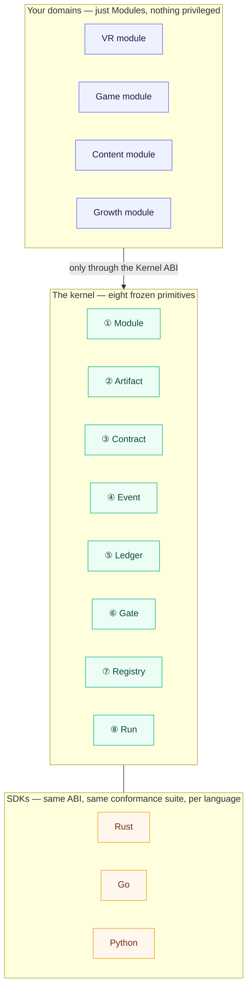
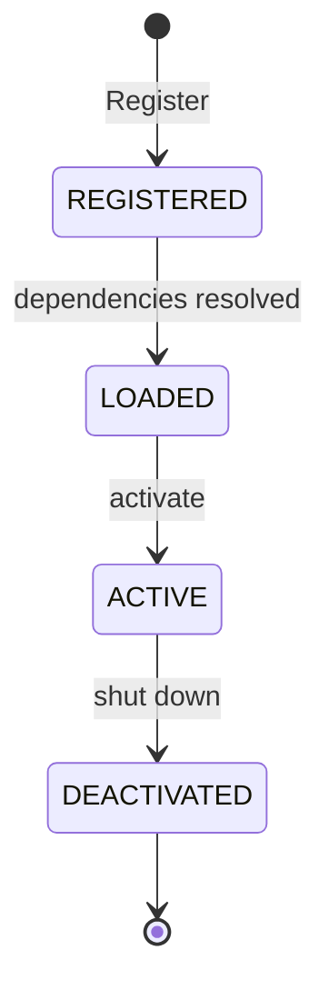
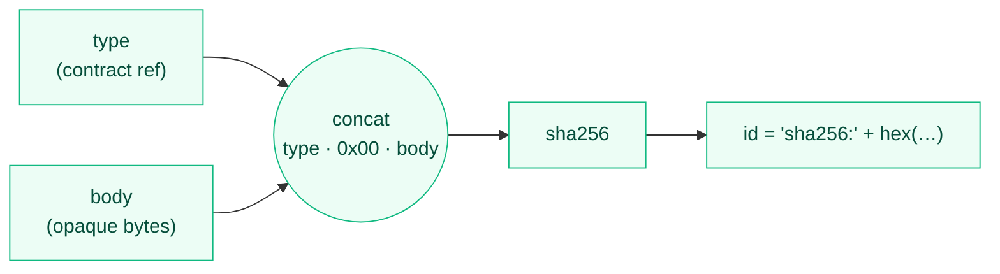
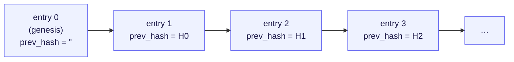
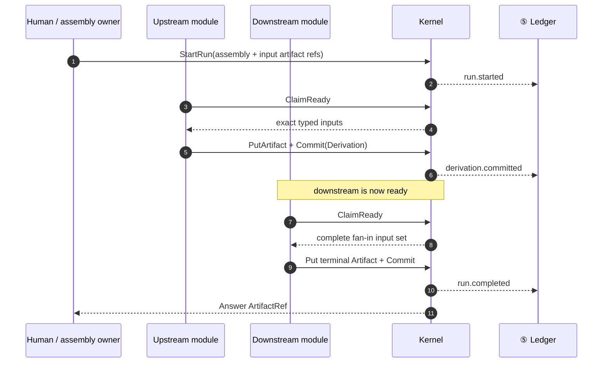
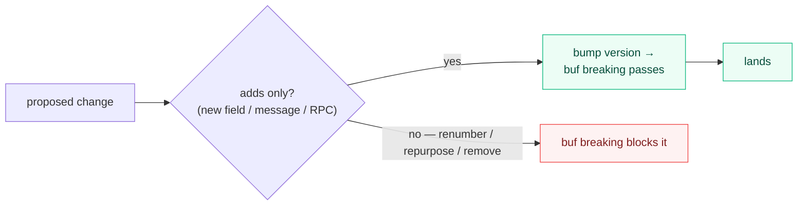

# srcport-substrate

**The one pluggable core for every future project — frozen once, reused forever.**

This repo is a **specification, not a framework**. It defines a small,
domain-neutral microkernel as a language-neutral contract; SDKs in each language
you need (Rust first) conform to it. It exists to end the pattern of re-deriving
the same substrate every time a new project starts.

- **[`SPEC.md`](SPEC.md)** — the two-page human-owned specification. Read this.
- **[`substrate.proto`](contracts/proto/srcport/substrate/v1/substrate.proto)** — the canonical contract (protobuf-first).
- **[`buf.yaml`](buf.yaml)** — lint + breaking-change enforcement.

---

## The big picture

Every project — VR, games, content, growth — is just a set of **Modules**
sitting on top of one shared, unchanging core. Modules never see each other;
they see only the kernel.



Nothing in the kernel knows about any domain. That shared frozen core is the
thing that finally becomes boring, trusted, and legible.

---

## See it run

[`example/`](example/) builds a tiny three-module domain on the Rust SDK, drives
a **real** convergent Run, then reconstructs the whole dataflow **solely by
decoding the append-only ledger** — proving, not merely illustrating, that
artifact refs are the data plane and the chain records exactly what happened.

```
cd example && cargo run
```

It prints a live trace and writes a self-contained `flow.html` — every box and
arrow rebuilt from the tamper-evident chain, never from live kernel state.

---

## The eight primitives

Eight primitives (the nouns) plus one `Kernel` ABI — the verb set (`Register`,
`PutArtifact`, `Publish`, …) that operates on them. Small enough to hold in your head.

| # | Primitive | Guarantees |
|---|-----------|------------|
| ① | **Module** | A vertical slice with typed capability ports; never imports another module. |
| ② | **Artifact** | Typed, content-addressed, **immutable**. Same content ⇒ same id. |
| ③ | **Contract** | The declarative schema — the **sole** coupling point between modules. |
| ④ | **Event** | Publish/subscribe topics with a kernel-assigned **total order** (`seq`). |
| ⑤ | **Ledger** | Append-only, **hash-chained**, tamper-evident record of every action. |
| ⑥ | **Gate** | A **human-held** checkpoint before anything irreversible. Non-bypassable. |
| ⑦ | **Registry** | Discovery — "what modules, capabilities, and contracts exist right now?" |
| ⑧ | **Run** | Applies an immutable input set to a finite typed assembly; must close as completed, stalled, failed, or cancelled. |

---

## Module lifecycle

A module moves through exactly four states — no back-doors, no skipping.



---

## Content addressing

The id **is** sha256 over `type · 0x00 · body`, so flipping a single byte yields
a brand-new id:



---

## The ledger is a hash chain

Every meaningful kernel action appends one entry, and each entry commits to the
previous entry's hash. Tamper with any entry and every later hash stops
verifying — the whole history is agent-observable and tamper-evident.



Each `hash = sha256(seq, kind, subject, detail, prev_hash)`.

---

## How the primitives converge (the bounded, feed-forward run)

A node is released only after every bound input artifact exists, so fan-in waits
rather than races; events may wake workers, but artifact refs — not event
payloads — are the run's data plane. The diagram below traces one such bounded run.



---

## The one rule

> **Do not create a new repo that re-implements this core.** If it lacks
> something, **widen this contract by adding to it**, tag a new version, and let
> every project pick it up. Re-derivation is the bug this repo exists to kill.

Evolution is by **addition, never mutation**:



A genuinely incompatible redesign becomes `…v2` living beside `v1`, never a
silent break.

---

## Layout

```
srcport-substrate/
├─ SPEC.md                                  # the human-owned specification
├─ buf.yaml                                 # lint + breaking-change enforcement
├─ buf.gen.yaml                             # codegen: contract → Go & Python types
├─ scripts/gen.sh                           # regenerate the SDK types
├─ contracts/proto/srcport/substrate/v1/
│  └─ substrate.proto                       # THE contract
├─ example/                                 # a runnable domain on the Rust SDK (see below)
└─ sdk/                                     # each conforms to SPEC.md
   ├─ rust/                                 # in-process Rust SDK (types generated by build.rs)
   ├─ go/                                   # in-process Go SDK (types generated via buf)
   └─ python/                               # in-process Python SDK (types generated via buf)
```

---

## Conformance

Every SDK's message types are **generated from `substrate.proto`** — Rust at
build time (`build.rs`), Go and Python via `buf generate` (committed). None
hand-writes the contract, so none can drift from it; CI fails if the committed
codegen falls out of sync. Every SDK realises the same `Kernel` ABI in-process
and ships the same convergence-aware conformance suite.
[`SPEC.md` §Conformance](SPEC.md) states each invariant in full; the eleven it proves:

| # | Invariant | | # | Invariant |
|---|-----------|---|---|-----------|
| 1 | **Addressing** | | 7 | **Ledger reconstruction & canonical detail** |
| 2 | **Immutability** | | 8 | **Address invariance** |
| 3 | **Ordering & isolation** | | 9 | **Feed-forward convergence** |
| 4 | **Ledger integrity** | | 10 | **Structural termination** |
| 5 | **Gate non-bypass** | | 11 | **Derivation preservation** |
| 6 | **Discovery** | | | |

As a cross-check, all three SDKs produce **byte-identical artifact addresses**
for the same `(type, body)`.

---

## Status

`v0.1` draft — **unfrozen, pending review**. Rust, Go, and Python implement the
same ABI; the `v1.0.0` freeze comes after the schema is approved.

---

## License

Copyright (c) srcport.com. All rights reserved.
